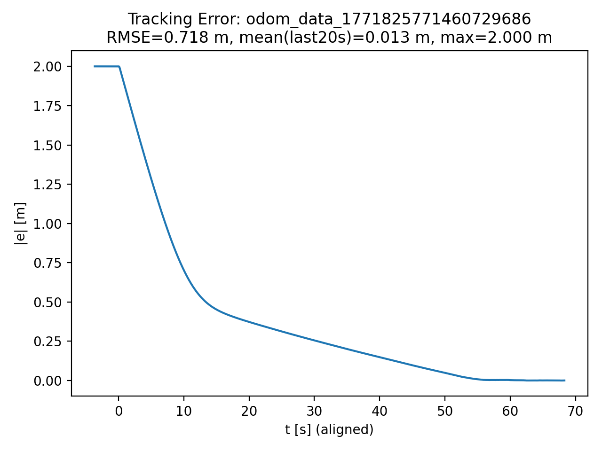

# ROS2 Circular Trajectory Tracking

Circular trajectory tracking for a unicycle-type mobile robot in ROS2 (Humble) with Gazebo simulation.

A feedforward + feedback controller is evaluated under varying curvature, angular velocity, noise, and actuator saturation.

---

## System

- Simulation: Gazebo + ros_gz_bridge
- Control frequency: 20 Hz
- State feedback: Odometry (x, y, yaw)

---

## Controller

Reference (circle):
x_d = c_x + R * cos(omega * t)  
y_d = c_y + R * sin(omega * t)

Feedforward:
- v_ff = R · ω
- w_ff = ω

Feedback:
- v = v_ff + k_v · e_fwd
- w = w_ff + k_lat · e_lat

Saturation:
- v ∈ [0, 0.15] m/s
- w ∈ [-1.5, 1.5] rad/s

---

## Experimental Conditions

- R ∈ {2.0, 3.0} m
- ω ∈ {0.07, 0.10} rad/s
- Gains: k_v = 0.35, k_lat = 2.20
- Noise: baseline and increased measurement noise
- Ablation: feedforward on/off

---

## Results

| Case | R (m) | ω (rad/s) | Gains | Noise (xy / yaw) | Feedforward | RMSE (m) | Mean Error (last 20s) (m) |
|------|-------|------------|-------|------------------|-------------|----------|--------------------------|
| Baseline | 2.0 | 0.07 | k_v=0.35, k_lat=2.20 | 0.01 / 0.005 | On | 0.718 | 0.013 |
| High ω (nominal gains) | 2.0 | 0.10 | k_v=0.35, k_lat=2.20 | 0.01 / 0.005 | On | 1.281 | 1.355 |
| High ω (retuned) | 2.0 | 0.10 | gains adjusted for stability | 0.01 / 0.005 | On | 0.703 | 0.008 |
| Large Radius | 3.0 | 0.07 | k_v=0.35, k_lat=2.20 | 0.01 / 0.005 | On | 1.193 | 0.006 |
| Increased Noise | 2.0 | 0.07 | k_v=0.35, k_lat=2.20 | 0.02 / 0.01 | On | 0.737 | 0.046 |
| No Feedforward | 2.0 | 0.07 | k_v=0.35, k_lat=2.20 | 0.01 / 0.005 | Off | 0.817 | 0.386 |

**Notes**

- Nominal gains refer to the baseline controller gains  
  (k_v = 0.35, k_lat = 2.20).

- Retuned gains were adjusted to compensate for increased angular velocity (ω = 0.10 rad/s) under actuator saturation limits.

- Increased noise case used:
  - noise_xy_std = 0.02  
  - noise_yaw_std = 0.01  
  (baseline was 0.01 / 0.005).

---

## Key Findings

- Feedforward reduces steady-state error (0.386 → 0.013 m).
- Higher ω requires gain retuning due to saturation.
- Noise degrades precision but maintains stability.
- Larger radius increases transient error but converges.

---

## Example (Baseline)

